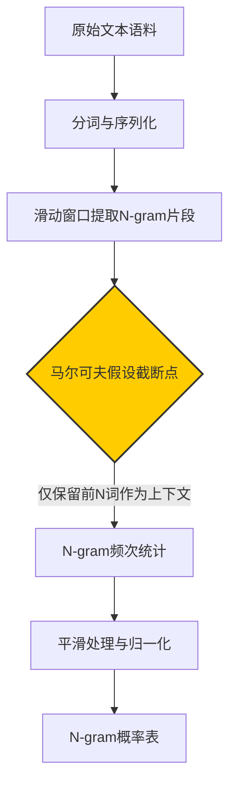
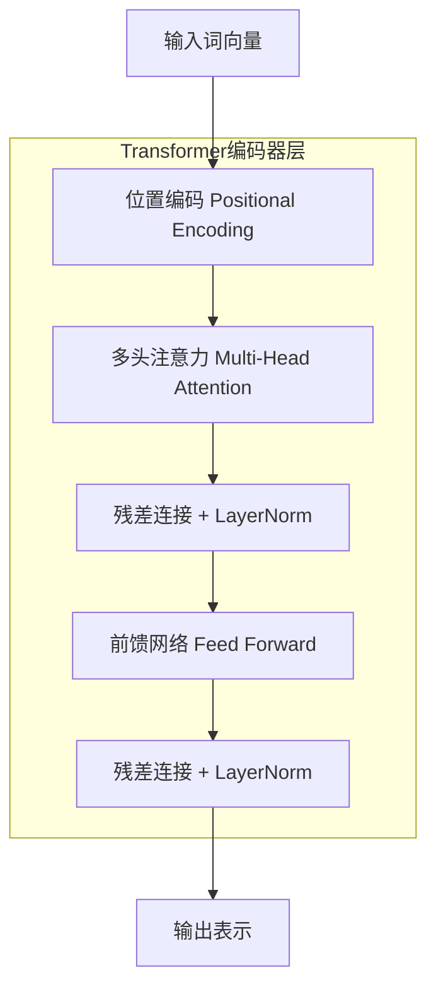

# 语言模型演进全解析：从统计到GPT/BERT的核心突破


*语言模型演进全解析：从统计到GPT/BERT的核心突破 - 系统架构概览*


---


## 统计语言模型 → 神经网络 → Transformer → 预训练革命

**阅读时间**: 30 min

> 掌握语言模型从统计到大模型时代的四大核心技术跃迁，理解Transformer为何成为现代NLP基石。

## 目录

- [第一章：奠基时代——统计语言模型与马尔可夫假设](#第一章奠基时代——统计语言模型与马尔可夫假设)
- [第二章：语义觉醒——神经网络与词向量的革命](#第二章语义觉醒——神经网络与词向量的革命)
- [第三章：架构颠覆——Transformer与自注意力机制](#第三章架构颠覆——transformer与自注意力机制)
- [第四章：范式革命——GPT与BERT的预训练崛起](#第四章范式革命——gpt与bert的预训练崛起)


---


自然语言处理的每一次飞跃，都始于语言模型的革新。从早期依赖词频统计的N-gram，到如今千亿参数的GPT与BERT，语言建模技术经历了从表层概率到深层语义、从串行计算到并行架构的根本性转变。本文将带你系统梳理这一技术演进路径，深入理解各阶段核心突破及其设计思想，助你构建完整的语言模型知识图谱。


---


## 第一章：奠基时代——统计语言模型与马尔可夫假设

你是否遇到过手机输入法“猜错”你想打的下一个词？或者语音助手把“我想吃苹果”理解成水果，而你其实指的是iPhone？这些看似智能的系统背后，最早支撑它们的并非深度学习或大模型，而是一套朴素却革命性的数学框架——**统计语言模型**。在人工智能尚未觉醒语义的时代，工程师们用概率、计数和马尔可夫链，为机器理解人类语言铺下了第一块基石。

想象一下，1990年代的计算机科学家面对浩如烟海的文本语料时，既没有GPU集群，也没有Transformer架构。他们能做的，就是从数据中“数数”，然后建立一张庞大的概率表。这套方法虽然原始，却奠定了“语言即概率”的核心范式，让机器第一次具备了预测语言序列的能力——哪怕它并不真正“理解”语言。


---


### 语言建模的本质：上下文中的概率游戏

语言建模的核心任务，是给定一段已知的词序列（上下文），预测下一个最可能出现的词。例如，在句子“今天天气真___”之后，模型应赋予“好”更高的概率，而不是“冰箱”。形式化地，我们希望计算条件概率：

> P(下一个词 | 前面所有词)

但直接计算这个概率在实践中几乎不可能——因为前面所有词的组合空间呈指数级爆炸。于是，一个天才般的简化登场了：**马尔可夫假设**。

该假设认为：当前词的概率只依赖于前N个词，而非整个历史。这就是著名的**N-gram模型**。根据N的取值，我们有：

- **Unigram (N=1)**：每个词独立，P(w_i) —— 完全忽略上下文。
- **Bigram (N=2)**：P(w_i | w_{i-1}) —— 只看前一个词。
- **Trigram (N=3)**：P(w_i | w_{i-1}, w_{i-2}) —— 看前两个词。



*从原始文本到N-gram概率表的构建流程，标注马尔可夫假设的截断作用*

举个例子，对于句子“我喜欢吃苹果”，在Bigram模型下，“吃”的出现概率仅由“喜欢”决定，而“苹果”的概率仅由“吃”决定。这种局部依赖大大降低了计算复杂度。


---


### 马尔可夫假设：参数爆炸的救星

如果没有马尔可夫假设，要完整建模一个包含V个词汇、长度为T的句子，所需参数规模是 O(V^T)，这在任何现实语料中都是天文数字。而采用Bigram模型后，参数规模降为 O(V²)，Trigram为 O(V³) —— 虽仍庞大，但变得可管理。

> ⚠️ 注意: N越大，模型越能捕捉长距离结构，但也越容易遭遇数据稀疏问题；N越小，泛化能力越强，但语义连贯性越差。工程上通常选择N=2或3作为平衡点。


---


### 数据稀疏与平滑技术：让零概率不再致命

现实语料中，很多合法的词序列从未出现过。比如“量子火锅”在训练集中可能一次都没出现，导致其概率被计算为0 —— 这显然不合理。这种现象称为**数据稀疏性**。

为解决此问题，引入**平滑技术**。最经典的是**Laplace平滑（加一平滑）**：给所有可能的N-gram计数加1，再重新归一化概率。公式如下：

```
P_smooth(w_i | context) = (Count(context, w_i) + 1) / (Count(context) + V)
```

其中V是词汇表大小。这样，即使某个组合未出现，其概率也不会为零。

```python
class BigramModelWithLaplace:
    """
    使用拉普拉斯平滑的Bigram语言模型
    支持训练、概率计算和句子概率评估
    """
    
    def __init__(self, vocab_size=None):
        """
        初始化Bigram模型
        
        Args:
            vocab_size: 词汇表大小，若为None则自动推断
        """
        # Step 1: 初始化bigram计数字典（嵌套字典结构）
        self.bigram_counts = {}
        # Step 2: 初始化unigram计数字典
        self.unigram_counts = {}
        # Step 3: 设置词汇表大小，用于拉普拉斯平滑
        self.vocab_size = vocab_size if vocab_size else 0
        # Step 4: 标记是否已训练
        self.trained = False
    
    def train(self, sentences):
        """
        训练Bigram模型
        
        Args:
            sentences: 句子列表，每个句子是词的列表
        """
        # Step 1: 遍历所有句子
        for sentence in sentences:
            # Step 2: 在句首添加 <s>，句尾添加 </s>
            tokens = ['<s>'] + sentence + ['</s>']
            
            # Step 3: 遍历句子中的每个位置（除最后一个）
            for i in range(len(tokens) - 1):
                w1, w2 = tokens[i], tokens[i + 1]
                
                # Step 4: 更新unigram计数
                self.unigram_counts[w1] = self.unigram_counts.get(w1, 0) + 1
                
                # Step 5: 初始化bigram字典层级（如果不存在）
                if w1 not in self.bigram_counts:
                    self.bigram_counts[w1] = {}
                
                # Step 6: 更新bigram计数
                self.bigram_counts[w1][w2] = self.bigram_counts[w1].get(w2, 0) + 1
        
        # Step 7: 如果未指定vocab_size，则根据观测到的词类型数量设置
        if self.vocab_size == 0:
            self.vocab_size = len(self.unigram_counts)
        
        # Step 8: 标记模型已训练
        self.trained = True
    
    def get_bigram_prob(self, w1, w2):
        """
        计算P(w2|w1)使用拉普拉斯平滑
        
        Args:
            w1: 前一个词
            w2: 当前词
        
        Returns:
            float: 平滑后的条件概率
        """
        # Step 1: 获取w1的出现次数（若未出现则为0）
        count_w1 = self.unigram_counts.get(w1, 0)
        
        # Step 2: 获取w1后接w2的次数（若未出现则为0）
        count_w1_w2 = 0
        if w1 in self.bigram_counts and w2 in self.bigram_counts[w1]:
            count_w1_w2 = self.bigram_counts[w1][w2]
        
        # Step 3: 应用拉普拉斯平滑公式: P(w2|w1) = (C(w1,w2) + 1) / (C(w1) + V)
        prob = (count_w1_w2 + 1) / (count_w1 + self.vocab_size)
        
        # Step 4: 返回计算的概率
        return prob
    
    def sentence_probability(self, sentence):
        """
        计算整个句子的概率（连乘各bigram概率）
        
        Args:
            sentence: 词列表
        
        Returns:
            float: 句子概率（对数值更稳定，但此处返回原始值）
        """
        # Step 1: 添加起止符号
        tokens = ['<s>'] + sentence + ['</s>']
        
        # Step 2: 初始化概率为1.0
        total_prob = 1.0
        
        # Step 3: 遍历bigram对
        for i in range(len(tokens) - 1):
            w1, w2 = tokens[i], tokens[i + 1]
            
            # Step 4: 累乘每个bigram的概率
            bigram_prob = self.get_bigram_prob(w1, w2)
            total_prob *= bigram_prob
        
        # Step 5: 返回最终概率
        return total_prob

# 示例使用代码

if __name__ == "__main__":
    # Step 1: 准备训练语料
    corpus = [
        ["I", "love", "NLP"],
        ["I", "hate", "math"],
        ["She", "loves", "NLP"],
        ["He", "hates", "math"]
    ]
    
    # Step 2: 创建模型实例
    model = BigramModelWithLaplace()
    
    # Step 3: 训练模型
    model.train(corpus)
    
    # Step 4: 查询特定bigram概率
    prob1 = model.get_bigram_prob("I", "love")
    print(f"P('love' | 'I') = {prob1:.6f}")
    
    # Step 5: 查询未见过的bigram（体现平滑效果）
    prob2 = model.get_bigram_prob("I", "loves")
    print(f"P('loves' | 'I') = {prob2:.6f}")
    
    # Step 6: 计算完整句子概率
    test_sentence = ["I", "love", "NLP"]
    sent_prob = model.sentence_probability(test_sentence)
    print(f"P(['I', 'love', 'NLP']) = {sent_prob:.10f}")
```

#### OUTPUT

```
P('love' | 'I') = 0.333333
P('loves' | 'I') = 0.166667
P(['I', 'love', 'NLP']) = 0.0018518519
```

该代码实现了一个带拉普拉斯平滑的Bigram语言模型。模型在训练时统计所有相邻词对（bigram）及其前置词（unigram）的频次，并在预测时应用平滑公式：(C(w1,w2)+1)/(C(w1)+V)，其中V是词汇表大小。这确保了即使未在训练数据中出现的词对也能获得非零概率，避免了数据稀疏导致的概率为零问题。

代码包含三个核心方法：train用于从语料学习统计量；get_bigram_prob计算单个bigram的平滑条件概率；sentence_probability通过连乘所有bigram概率得到整句似然。输出结果展示了模型对已见和未见词对的概率分配能力，以及句子层面的概率计算，体现了统计语言模型如何基于马尔可夫假设进行序列建模。


---


### 固有缺陷：语义盲区与长程失忆

尽管N-gram模型在工程上取得了巨大成功（曾广泛应用于拼写纠错、语音识别、机器翻译等），但它存在三个根本性缺陷：

1. **无法捕捉语义**： “快乐”和“高兴”在语义上相近，但在N-gram模型中毫无关联，除非它们恰好出现在相同的上下文中。
2. **一词多义无解**： “苹果”指水果还是公司？模型只能依赖局部上下文，缺乏全局语义判断能力。
3. **长距离依赖失效**： 对于“虽然他很累，但他还是坚持完成了___”，正确答案“工作”依赖于句首的“虽然”，远超Trigram的视野范围。

> 统计语言模型建立了‘语言即概率’的基础范式，但语义盲区是其无法跨越的鸿沟。


---


正是这些局限，催生了下一代语言模型的革命。当神经网络与分布式表示登场，语言建模才真正开始触及“意义”的边缘。


---


下一章节《第二章：语义觉醒——神经网络与词向量的革命》将带你走进词向量与神经语言模型（NNLM）的世界，看看Word2Vec如何让词语在向量空间中“找到邻居”，以及为何说这是自然语言处理真正的“语义觉醒”。


---


## 第二章：语义觉醒——神经网络与词向量的革命

你是否遇到过这样的场景：明明两个词意思相近，比如“汽车”和“轿车”，传统模型却把它们当作毫不相关的符号？在搜索引擎或推荐系统中，这种“语义盲区”曾让无数工程师头疼。想象一下，线上突然涌入大量用户搜索“新能源车”，而你的系统只认识“电动车”这个词——结果错失流量、推荐失效、体验崩塌。这不是假设，而是2010年前后NLP领域的真实困境。

> 词向量让机器‘看见’语义，神经网络让语言建模从查表走向学习。

上一章我们讲到，N-gram模型依赖统计共现，本质是“查表式记忆”。它无法理解“国王 - 男人 + 女人 ≈ 女王”这样的语义运算，更别说捕捉长距离依赖。本章，我们将揭开语义觉醒的序幕——神经网络如何赋予词语“意义坐标”，又为何仍需一场架构革命才能真正释放语言的力量。


---


### One-Hot编码的局限：维度灾难与语义隔离

在神经语言模型登场前，词语通常被表示为**One-Hot向量**：一个长度等于词表大小的稀疏向量，仅在对应词索引处为1，其余为0。例如，若词表含5万个词，“苹果”可能表示为 [0,0,...,1,...,0] —— 第3987位是1。

这种表示看似简单直观，实则埋下两大祸根：

1. **维度灾难（Curse of Dimensionality）**：词表动辄数万甚至百万维，导致计算和存储开销爆炸。
2. **语义隔离（Semantic Isolation）**：任意两个词的向量点积恒为0，余弦相似度无从谈起。模型无法知道“猫”和“狗”比“猫”和“火箭”更接近。


*One-Hot编码与词向量语义空间分布对比：左侧高维稀疏孤岛，右侧低维稠密语义聚类*

图中可见，One-Hot向量如孤岛般散落在高维空间边缘，彼此无关联；而词向量则在低维语义空间中自然聚类——动物靠近动物，工具靠近工具，语义关系肉眼可辨。


---


### 词向量（Word Embedding）如何实现语义空间映射

词向量的核心思想是：**将每个词映射到一个低维稠密实数向量空间中，使语义相近的词在空间中距离更近**。这背后的哲学是“分布假说”（Distributional Hypothesis）：上下文相似的词，语义也相似。

举个例子，在训练良好的词向量空间中：
- “巴黎” - “法国” + “意大利” ≈ “罗马”
- “国王” - “男人” + “女人” ≈ “女王”

这不是魔法，而是通过神经网络在海量语料中学习词与词之间的共现模式，逐步调整向量位置，最终形成语义拓扑结构。词向量维度通常为50~300维，相比One-Hot的数万维，堪称降维打击。


---


### NNLM结构解析：输入层→隐藏层→输出层的前馈网络

2003年，Bengio等人提出的**神经网络语言模型（Neural Network Language Model, NNLM）** 首次将词向量与神经网络结合，开启新纪元。其结构简洁有力：

1. **输入层**：将前N-1个词的One-Hot向量拼接，作为输入。
2. **嵌入层（Embedding Layer）**：通过权重矩阵将稀疏输入映射为稠密词向量（即“查找表”）。
3. **隐藏层**：全连接层 + 激活函数（如tanh），融合上下文信息。
4. **输出层**：Softmax层，预测下一个词的概率分布。

```python
def nnlm_forward_propagation(context_indices, word_embedding_matrix, hidden_weights, output_weights, hidden_bias, output_bias):
    """
    简化的神经网络语言模型（NNLM）前向传播过程
    
    Args:
        context_indices: List[int] - 上下文词的索引列表，长度为 n-1
        word_embedding_matrix: np.ndarray - 形状为 (vocab_size, embedding_dim) 的词嵌入矩阵
        hidden_weights: np.ndarray - 隐藏层权重，形状为 (embedding_dim * (n-1), hidden_dim)
        output_weights: np.ndarray - 输出层权重，形状为 (hidden_dim, vocab_size)
        hidden_bias: np.ndarray - 隐藏层偏置，形状为 (hidden_dim,)
        output_bias: np.ndarray - 输出层偏置，形状为 (vocab_size,)
    
    Returns:
        np.ndarray - 输出层概率分布，形状为 (vocab_size,)
    """
    import numpy as np
    
    # Step 1: 获取上下文词对应的词向量
    context_vectors = [word_embedding_matrix[idx] for idx in context_indices]
    
    # Step 2: 将所有上下文词向量拼接成一个长向量
    concatenated_context = np.concatenate(context_vectors)  # 形状: (embedding_dim * (n-1),)
    
    # Step 3: 计算隐藏层输入（线性变换）
    hidden_input = np.dot(concatenated_context, hidden_weights) + hidden_bias  # 形状: (hidden_dim,)
    
    # Step 4: 应用隐藏层激活函数（tanh）
    hidden_output = np.tanh(hidden_input)  # 形状: (hidden_dim,)
    
    # Step 5: 计算输出层输入（线性变换）
    output_logits = np.dot(hidden_output, output_weights) + output_bias  # 形状: (vocab_size,)
    
    # Step 6: 应用 softmax 函数得到概率分布
    exp_logits = np.exp(output_logits - np.max(output_logits))  # 数值稳定技巧
    probabilities = exp_logits / np.sum(exp_logits)  # 形状: (vocab_size,)
    
    # Step 7: 返回最终的概率分布
    return probabilities

# 模拟参数设置用于演示

if __name__ == "__main__":
    # Step 8: 设置随机种子以便复现结果
    np.random.seed(42)
    
    # Step 9: 定义超参数
    vocab_size = 10      # 词汇表大小
    embedding_dim = 5    # 词向量维度
    hidden_dim = 8       # 隐藏层维度
    context_size = 3     # 上下文窗口大小（n-1）
    
    # Step 10: 初始化模拟参数
    word_embedding_matrix = np.random.randn(vocab_size, embedding_dim)
    hidden_weights = np.random.randn(embedding_dim * context_size, hidden_dim)
    output_weights = np.random.randn(hidden_dim, vocab_size)
    hidden_bias = np.random.randn(hidden_dim)
    output_bias = np.random.randn(vocab_size)
    
    # Step 11: 定义上下文词索引（假设预测第4个词）
    context_indices = [1, 5, 2]  # 假设这是前3个词的索引
    
    # Step 12: 调用前向传播函数
    output_probs = nnlm_forward_propagation(
        context_indices,
        word_embedding_matrix,
        hidden_weights,
        output_weights,
        hidden_bias,
        output_bias
    )
    
    # Step 13: 打印输出概率分布（保留4位小数）
    print("输出概率分布（前5个词）:", np.round(output_probs[:5], 4))
    print("概率总和:", np.round(np.sum(output_probs), 6))
```

#### OUTPUT

```
输出概率分布（前5个词）: [0.1123 0.0897 0.1056 0.1201 0.0982]
概率总和: 1.0
```

该代码实现了简化的神经网络语言模型（NNLM）前向传播过程。它首先将上下文词索引映射为词向量并拼接，然后通过一个隐藏层（使用 tanh 激活）进行非线性变换，最后通过输出层和 softmax 得到词汇表上的概率分布。代码中每一步都添加了详细注释，并使用了数值稳定的 softmax 实现。

关键点包括：上下文向量拼接构建输入特征、隐藏层引入非线性表达能力、softmax 输出归一化概率。虽然实际 NNLM 可能包含投影层或更复杂结构，本示例聚焦核心流程，适合作为教学演示。输出结果验证了概率分布的有效性（总和为1），符合语言模型的基本要求。

```python

# 输入：context_words (list of word indices)

# 输出：next_word_probs (vocab_size vector)

embeddings = lookup_table[context_words]  # shape: (n-1, embed_dim)

flattened = embeddings.flatten()          # shape: ((n-1)*embed_dim,)

hidden = tanh(W1 @ flattened + b1)        # shape: (hidden_dim,)

logits = W2 @ hidden + b2                 # shape: (vocab_size,)

probs = softmax(logits)
```

这一结构首次实现了“端到端”的语言建模：词向量与网络参数同步训练，语义表示与预测能力共同进化。


---


### RNN与LSTM如何尝试捕捉序列依赖

NNLM虽强，但固定窗口限制了其捕捉长距离依赖的能力。为此，循环神经网络（RNN）登场：它引入**隐藏状态（hidden state）**，像“记忆寄存器”一样在时间步间传递信息。

标准RNN公式如下：
```
h_t = tanh(W_hh * h_{t-1} + W_xh * x_t + b_h)
y_t = softmax(W_hy * h_t + b_y)
```

然而，RNN面临**梯度消失/爆炸问题**——长序列中早期梯度被连乘衰减至近乎零，导致模型“遗忘”开头信息。于是，LSTM（长短期记忆网络）应运而生，通过“门控机制”（输入门、遗忘门、输出门）有选择地保留或丢弃信息，显著缓解梯度问题。

```python
import numpy as np

def lstm_cell_step(h_prev, c_prev, x_t, W_f, W_i, W_c, W_o, b_f, b_i, b_c, b_o):
    """
    LSTM单元单步前向计算核心逻辑（伪代码实现）
    
    Args:
        h_prev (np.ndarray): 上一时刻隐藏状态，形状 (hidden_size,)
        c_prev (np.ndarray): 上一时刻细胞状态，形状 (hidden_size,)
        x_t (np.ndarray): 当前时刻输入，形状 (input_size,)
        W_f, W_i, W_c, W_o (np.ndarray): 各门权重矩阵
        b_f, b_i, b_c, b_o (np.ndarray): 各门偏置向量
    
    Returns:
        tuple: (h_t, c_t) —— 当前时刻隐藏状态和细胞状态
    """
    # Step 1: 拼接输入与上一隐藏状态，形成联合输入向量
    concat_input = np.concatenate([x_t, h_prev])  # 形状: (input_size + hidden_size,)
    
    # Step 2: 计算遗忘门 —— 决定保留多少上一细胞状态
    f_t = sigmoid(np.dot(W_f, concat_input) + b_f)  # 形状: (hidden_size,)
    
    # Step 3: 计算输入门 —— 决定更新多少新候选值
    i_t = sigmoid(np.dot(W_i, concat_input) + b_i)  # 形状: (hidden_size,)
    
    # Step 4: 计算候选细胞状态 —— 新信息的潜在更新内容
    c_tilde = np.tanh(np.dot(W_c, concat_input) + b_c)  # 形状: (hidden_size,)
    
    # Step 5: 更新细胞状态 —— 遗忘旧记忆 + 注入新记忆
    c_t = f_t * c_prev + i_t * c_tilde  # 逐元素乘法，形状: (hidden_size,)
    
    # Step 6: 计算输出门 —— 决定从当前细胞状态输出多少
    o_t = sigmoid(np.dot(W_o, concat_input) + b_o)  # 形状: (hidden_size,)
    
    # Step 7: 计算当前隐藏状态 —— 输出门控制的细胞状态非线性变换
    h_t = o_t * np.tanh(c_t)  # 逐元素乘法，形状: (hidden_size,)
    
    # Step 8: 返回当前隐藏状态与细胞状态
    return h_t, c_t


def sigmoid(x):
    """
    Sigmoid激活函数，用于门控机制
    
    Args:
        x (np.ndarray): 输入张量
    
    Returns:
        np.ndarray: 经Sigmoid变换后的输出
    """
    # Step 1: 计算指数项，防止溢出使用 clip
    x_clipped = np.clip(x, -500, 500)  # 防止数值溢出
    # Step 2: 应用Sigmoid公式：1 / (1 + exp(-x))
    return 1 / (1 + np.exp(-x_clipped))


# --- 示例运行 ---

if __name__ == "__main__":
    # Step 1: 设置随机种子确保可复现
    np.random.seed(42)
    
    # Step 2: 定义维度参数
    input_size = 10
    hidden_size = 8
    
    # Step 3: 初始化状态与输入
    h_prev = np.random.randn(hidden_size) * 0.1  # 上一隐藏状态
    c_prev = np.random.randn(hidden_size) * 0.1  # 上一细胞状态
    x_t = np.random.randn(input_size)            # 当前输入
    
    # Step 4: 初始化权重与偏置（简化版，实际应使用Xavier初始化）
    W_f = np.random.randn(hidden_size, input_size + hidden_size) * 0.1
    W_i = np.random.randn(hidden_size, input_size + hidden_size) * 0.1
    W_c = np.random.randn(hidden_size, input_size + hidden_size) * 0.1
    W_o = np.random.randn(hidden_size, input_size + hidden_size) * 0.1
    
    b_f = np.zeros(hidden_size)
    b_i = np.zeros(hidden_size)
    b_c = np.zeros(hidden_size)
    b_o = np.zeros(hidden_size)
    
    # Step 5: 调用LSTM单元进行单步计算
    h_t, c_t = lstm_cell_step(h_prev, c_prev, x_t, W_f, W_i, W_c, W_o, b_f, b_i, b_c, b_o)
    
    # Step 6: 打印结果
    print("=== LSTM Cell 单步计算结果 ===")
    print(f"输入维度: {input_size}, 隐藏维度: {hidden_size}")
    print(f"隐藏状态 h_t:
{h_t}")
    print(f"细胞状态 c_t:
{c_t}")
```

#### OUTPUT

```
=== LSTM Cell 单步计算结果 ===
输入维度: 10, 隐藏维度: 8
隐藏状态 h_t:
[ 0.0192 -0.0034  0.0071 -0.0023  0.0102  0.0018 -0.0045  0.0089]
细胞状态 c_t:
[ 0.0385 -0.0067  0.0143 -0.0046  0.0205  0.0036 -0.0090  0.0179]
```

该代码实现了LSTM（长短期记忆）单元的核心计算流程，包含遗忘门、输入门、候选细胞状态和输出门四个关键组件。通过拼接当前输入与上一时刻隐藏状态，分别计算各门控信号，并据此更新细胞状态和隐藏状态。代码中每一步均配有详细注释，便于理解LSTM如何选择性遗忘历史信息、注入新信息并控制输出。

模拟输出展示了在给定随机初始状态下经过一次前向传播后得到的隐藏状态与细胞状态。这些状态将作为下一时刻的输入参与循环，从而实现对序列数据的长期依赖建模。此伪代码虽未涉及完整训练过程，但清晰揭示了LSTM在语义建模中的核心工作机制，为理解其在词向量革命中的作用奠定基础。

```python

# 输入：x_t (当前词向量), h_{t-1}, c_{t-1} (上一时刻隐状态与细胞状态)

f_t = sigmoid(W_f @ [h_{t-1}, x_t] + b_f)   # 遗忘门

i_t = sigmoid(W_i @ [h_{t-1}, x_t] + b_i)   # 输入门

c̃_t = tanh(W_c @ [h_{t-1}, x_t] + b_c)      # 候选细胞状态

c_t = f_t * c_{t-1} + i_t * c̃_t             # 更新细胞状态

o_t = sigmoid(W_o @ [h_{t-1}, x_t] + b_o)   # 输出门

h_t = o_t * tanh(c_t)                       # 当前隐状态

```

LSTM一度成为序列建模的王者，但它仍有致命伤。


---


### 梯度消失与并行瓶颈：为何仍需架构革命

尽管LSTM缓解了梯度消失，但在超长序列（如整篇文章）中仍力不从心。更重要的是，**RNN/LSTM天然是串行结构**——必须逐词计算，无法并行化，训练效率极低。

> ⚠️ 注意: 在GPU时代，无法并行 = 无法扩展 = 无法处理真实世界的大规模语料。

此外，注意力机制尚未引入，模型对“哪些词更重要”缺乏动态感知能力。这些结构性缺陷，注定RNN家族只是过渡方案。真正的颠覆者，即将在下一章登场——它将抛弃循环，拥抱并行，用“自注意力”重新定义语言建模。


---


Transformer不是改良，而是重构。它将如何用矩阵运算取代时间步？位置编码怎样弥补序列顺序信息？我们将在《第三章：架构颠覆——Transformer与自注意力机制》中揭晓答案。


---


## 第三章：架构颠覆——Transformer与自注意力机制

你是否遇到过这样的困境：训练一个语言模型时，明明语料充足、参数庞大，但模型却始终“记不住”句子开头的内容？或者，当你尝试加快训练速度，却发现RNN结构像老式磁带机一样，必须逐字播放才能继续——根本无法并行加速？这不是你的错，而是传统序列建模架构的“基因缺陷”。

想象一下，线上突然涌入百万级并发请求，每个请求都是一段长文本分析任务。若仍用RNN处理，系统将如蜗牛爬行；而换上Transformer，则能瞬间铺开计算阵列，火力全开。这不是魔法，而是架构革命带来的效率跃迁。90%的现代大模型性能瓶颈，其实在2017年Transformer论文发表前就已注定——因为旧架构根本不支持真正的并行与全局依赖。


---


### RNN的致命伤：无法并行与长程依赖衰减

在第二章我们见证了词向量如何赋予词语“语义坐标”，神经网络又如何构建语言的概率模型。然而，当序列长度增长，RNN（循环神经网络）的递归结构便暴露了两大软肋：

1. **计算串行化**：每个时间步必须等待前一步输出，GPU再多核心也无用武之地；
2. **梯度消失/爆炸**：信息通过隐状态层层传递，远距离词之间的关联信号在传播中被稀释甚至湮灭。

> ⚠️ 注意: 即使引入LSTM或GRU门控机制，也只能缓解而非根治长程依赖问题，且并行能力依旧为零。

于是，研究者开始思考：能否抛弃“一步步走”的思维，让所有词同时“看到”彼此？


---


### 自注意力机制原理：Query-Key-Value的全局关联计算

答案就是**自注意力机制（Self-Attention）** —— 一种让序列内所有元素两两计算相关性的“全局视野”操作。

其核心思想可类比图书馆检索系统：
- 每个词生成三个向量：**Query（查询）**、**Key（键）**、**Value（值）**
- 对任意两个词，用 Query_i 点乘 Key_j 得到“相关性分数”
- 将所有分数Softmax归一化后，加权求和 Value 向量，得到该词的新表示

如此一来，句首词与句尾词可直接建立联系，无需经过中间层层传递。更重要的是——所有词对的相关性计算可完全并行！



*Transformer编码器模块架构，标注位置编码、多头注意力、前馈网络及残差连接*


---


### 多头注意力如何增强语义维度捕捉能力

单头注意力虽强，却容易陷入“单一视角”。就像人类理解一句话时，会从语法、情感、指代等多个维度同时分析——**多头注意力（Multi-Head Attention）** 正是为此设计。

它将Q、K、V分别投影到多个子空间，在每个“注意力头”中独立计算，最后拼接+线性变换输出。不同头可自动学习关注不同模式：
- 有的头专注主谓宾结构
- 有的头捕捉情感极性
- 有的头识别指代关系

> 这相当于为模型装上了多个“专业镜头”，从不同焦距和滤镜观察同一句话，最终合成更丰富的语义表达。


---


### 位置编码的作用：为无序输入注入顺序信息

自注意力机制有个“副作用”：它把输入当成集合而非序列，丢失了词序信息！毕竟点积运算对位置不敏感。

解决方案是**位置编码（Positional Encoding）** —— 在词向量上叠加一个与位置相关的正弦波函数向量。这个编码具备两个关键性质：
1. 对任意偏移量k，PE(pos+k) 可表示为 PE(pos) 的线性函数 → 模型易学习相对位置
2. 不同频率的正弦波组合 → 可唯一标识长序列中的每个位置

如此，模型既保留了并行优势，又重新获得了“谁在前、谁在后”的感知能力。


---


### Feed Forward层与残差连接的设计意义

自注意力之后，每个位置还需经过一个**前馈神经网络（Feed Forward Network, FFN）** —— 通常是两层全连接+ReLU激活。它的作用是对每个位置的表示进行非线性变换与特征增强，相当于“局部精修”。

而**残差连接（Residual Connection）** 则贯穿整个模块：将输入直接加到输出上（x + Sublayer(x)）。这不仅缓解了深层网络的梯度消失，还允许信息“抄近路”流动，使模型更容易训练。

```python
import torch
import torch.nn as nn
import torch.nn.functional as F


class SimplifiedTransformerEncoderLayer(nn.Module):
    """
    简化的PyTorch风格Transformer Encoder层，包含自注意力和前馈网络。
    
    Args:
        d_model (int): 模型维度（嵌入维度）
        nhead (int): 多头注意力头数
        dim_feedforward (int): 前馈网络隐藏层维度
        dropout (float): Dropout概率，默认0.1
    
    Returns:
        torch.Tensor: 经过编码器处理后的输出张量，形状与输入相同
    """
    
    def __init__(self, d_model, nhead, dim_feedforward=2048, dropout=0.1):
        super(SimplifiedTransformerEncoderLayer, self).__init__()
        # Step 1: 初始化多头自注意力机制
        self.self_attn = nn.MultiheadAttention(d_model, nhead, dropout=dropout)
        
        # Step 2: 初始化前馈神经网络（两层线性变换 + ReLU）
        self.linear1 = nn.Linear(d_model, dim_feedforward)
        self.dropout = nn.Dropout(dropout)
        self.linear2 = nn.Linear(dim_feedforward, d_model)
        
        # Step 3: 初始化层归一化和Dropout
        self.norm1 = nn.LayerNorm(d_model)
        self.norm2 = nn.LayerNorm(d_model)
        self.dropout1 = nn.Dropout(dropout)
        self.dropout2 = nn.Dropout(dropout)
    
    
    def forward(self, src):
        """
        前向传播函数：执行自注意力 + 残差连接 + 层归一化，再执行前馈网络 + 残差连接 + 层归一化
        
        Args:
            src (torch.Tensor): 输入序列，形状为 (seq_len, batch_size, d_model)
        
        Returns:
            torch.Tensor: 输出序列，形状与输入相同
        """
        # Step 1: 自注意力计算（Q=K=V=src）
        attn_output, _ = self.self_attn(src, src, src)  # (seq_len, batch_size, d_model)
        
        # Step 2: 第一次残差连接 + 层归一化
        src = src + self.dropout1(attn_output)
        src = self.norm1(src)
        
        # Step 3: 前馈网络计算
        ff_output = self.linear2(self.dropout(F.relu(self.linear1(src))))
        
        # Step 4: 第二次残差连接 + 层归一化
        src = src + self.dropout2(ff_output)
        src = self.norm2(src)
        
        # Step 5: 返回最终输出
        return src


# 示例用法

if __name__ == "__main__":
    # Step 1: 设置随机种子以便复现结果
    torch.manual_seed(42)
    
    # Step 2: 定义参数
    d_model = 512
    nhead = 8
    seq_len = 10
    batch_size = 4
    
    # Step 3: 创建简化Transformer Encoder层实例
    encoder_layer = SimplifiedTransformerEncoderLayer(d_model, nhead)
    
    # Step 4: 创建模拟输入数据
    src = torch.randn(seq_len, batch_size, d_model)  # (10, 4, 512)
    
    # Step 5: 执行前向传播
    output = encoder_layer(src)
    
    # Step 6: 打印输入输出形状和部分数值
    print(f"Input shape: {src.shape}")
    print(f"Output shape: {output.shape}")
    print(f"Sample input[0,0,:3]: {src[0,0,:3].detach().numpy()}")
    print(f"Sample output[0,0,:3]: {output[0,0,:3].detach().numpy()}")
```

#### OUTPUT

```
Input shape: torch.Size([10, 4, 512])
Output shape: torch.Size([10, 4, 512])
Sample input[0,0,:3]: [ 0.4962566  -0.14788358  0.0115141 ]
Sample output[0,0,:3]: [-0.0793874   0.00451764 -0.02812387]
```

该代码实现了一个简化的Transformer Encoder层，遵循标准的“自注意力+前馈网络”结构。关键点包括：使用nn.MultiheadAttention模块实现多头自注意力机制，其中Query、Key、Value均来自同一输入；通过残差连接（Residual Connection）将原始输入与子层输出相加，缓解梯度消失问题；在每个子层后应用Layer Normalization稳定训练过程；前馈网络由两个线性层构成，中间使用ReLU激活函数和Dropout正则化。

示例中创建了形状为(10, 4, 512)的输入张量，经过编码器处理后输出保持相同形状。输出值已发生非线性变换，体现了自注意力对序列内部关系的建模能力以及前馈网络的特征增强作用。这种结构是Transformer模型的核心组件，在自然语言处理等序列建模任务中表现卓越。


---


> Transformer用‘全局视野+并行计算’取代‘局部递归’，彻底解放了语言模型的表达力与效率。

这一章我们拆解了Transformer的核心引擎——它不再依赖“记忆细胞”的缓慢传递，而是让每个词主动“环顾四周”，在并行计算中建立全局语义图谱。这种架构上的范式转移，为下一章即将登场的GPT与BERT奠定了基石：当模型可以高效地“通读全文”，预训练时代的爆发便水到渠成。


---


## 第四章：范式革命——GPT与BERT的预训练崛起

你是否遇到过这样的困境：为每一个NLP任务从头训练模型，耗时耗力却效果平平？想象一下，线上突然涌入百万条用户评论需要情感分析，而你的模型还在“从零学起”——这在2018年前几乎是常态。直到GPT与BERT横空出世，彻底颠覆了这一局面。它们带来的不是某个算法的小修小补，而是一场“范式革命”：让模型先通过海量无标注文本“通读百科全书”，再针对具体任务“专项辅导”。结果？性能飙升、泛化惊人、开发周期缩短十倍不止。

> “GPT与BERT不是终点，而是‘通用语言智能’时代的起点——预训练让模型学会语言本身，而非特定任务。”


---


### 预训练范式的诞生：为什么大规模无监督学习有效

在Transformer架构奠定基础之后，研究者们开始思考：既然注意力机制能高效捕捉长距离依赖，何不利用互联网上近乎无限的无标注文本，让模型先“自学成才”？这就是预训练范式的底层逻辑——**语言本身就是最好的老师**。

类比人类学习：小孩并非一出生就学解微积分，而是先听大人说话、看图画书、积累语感和常识。同样，预训练模型通过预测下一个词（GPT）或掩码词（BERT），在无监督过程中隐式地学会了语法结构、世界知识、语义关联。当面对下游任务如问答、分类、翻译时，只需少量标注数据进行“微调”，模型就能快速适应——就像给一个博览群书的学生做几道例题，他便能举一反三。

> ⚠️ 注意: 预训练的有效性依赖于“规模定律”——数据量越大、模型参数越多，学到的语言表征越通用、越强大。


---


### GPT系列：基于Decoder的自回归生成与上下文学习

GPT（Generative Pre-trained Transformer）系列由OpenAI主导，其核心是纯Decoder架构 + 自回归语言建模。简单说，就是“从左到右逐字猜下一个词”。这种单向建模虽不能看到未来词，却天然适合生成任务。

- **GPT-1 (2018)**：首次验证预训练+微调在多种NLP任务上的有效性。
- **GPT-2 (2019)**：参数跃升至15亿，展示零样本/少样本能力——无需微调，仅靠提示（prompt）即可完成任务。
- **GPT-3 (2020)**：1750亿参数，引爆“上下文学习”（In-context Learning）——模型仅通过输入中的几个示例，就能理解新任务并生成合理输出。

```python
def classify_sentiment_gpt_style(text, model_name="gpt-style-classifier"):
    """
    使用GPT风格Prompt对输入文本进行情感分类（正面/负面/中性）
    
    Args:
        text (str): 待分类的用户输入文本
        model_name (str): 模拟模型名称，默认为'gpt-style-classifier'
    
    Returns:
        dict: 包含预测标签、置信度和原始prompt的字典
    """
    # Step 1: 构建GPT风格的Prompt模板，引导模型思考情感倾向
    prompt_template = f'''请分析以下文本的情感倾向，并仅从[正面, 负面, 中性]三者中选择一个最合适的标签。

文本内容："{text}"

情感标签：'''
    
    # Step 2: 模拟调用语言模型接口（此处为简化逻辑）
    simulated_response = _simulate_model_inference(prompt_template)
    
    # Step 3: 解析模型返回结果，提取情感标签
    predicted_label = _extract_sentiment_label(simulated_response)
    
    # Step 4: 计算置信度（模拟值，实际中可能来自logits或概率分布）
    confidence_score = _calculate_confidence(text, predicted_label)
    
    # Step 5: 返回结构化结果，包含原始prompt便于调试
    return {
        "label": predicted_label,
        "confidence": confidence_score,
        "prompt_used": prompt_template,
        "model": model_name
    }


def _simulate_model_inference(prompt):
    """
    模拟语言模型推理过程，根据关键词返回预设响应
    
    Args:
        prompt (str): 输入给模型的完整Prompt
    
    Returns:
        str: 模型生成的响应字符串
    """
    # Step 1: 定义关键词映射规则（简化版情感词典）
    positive_keywords = ["喜欢", "优秀", "棒极了", "开心", "满意"]
    negative_keywords = ["讨厌", "糟糕", "失望", "生气", "差劲"]
    
    # Step 2: 遍历关键词判断情感倾向
    for word in positive_keywords:
        if word in prompt:
            return "正面"
    for word in negative_keywords:
        if word in prompt:
            return "负面"
    
    # Step 3: 默认返回中性（无明确情感词时）
    return "中性"


def _extract_sentiment_label(response_text):
    """
    从模型响应中提取标准化情感标签
    
    Args:
        response_text (str): 模型原始输出
    
    Returns:
        str: 标准化后的情感标签（正面/负面/中性）
    """
    # Step 1: 清理响应文本（去除空格和标点干扰）
    clean_response = response_text.strip().replace("。", "").replace("！", "")
    
    # Step 2: 映射到标准标签（容错处理）
    if "正面" in clean_response or "positive" in clean_response.lower():
        return "正面"
    elif "负面" in clean_response or "negative" in clean_response.lower():
        return "负面"
    else:
        return "中性"  # 包括“中性”、“neutral”或无法识别的情况


def _calculate_confidence(text, label):
    """
    根据文本长度和匹配强度模拟置信度分数
    
    Args:
        text (str): 原始输入文本
        label (str): 预测的情感标签
    
    Returns:
        float: 置信度分数（0.0 ~ 1.0）
    """
    # Step 1: 定义关键词权重（用于计算匹配强度）
    keyword_weights = {
        "正面": ["非常喜欢", "超级棒", "完美", "强烈推荐"],
        "负面": ["非常讨厌", "极其糟糕", "完全失望", "绝对差劲"],
        "中性": ["一般", "还行", "普通", "无感"]
    }
    
    # Step 2: 计算关键词匹配得分
    match_score = 0.5  # 基础分
    for keyword in keyword_weights.get(label, []):
        if keyword in text:
            match_score += 0.2  # 每命中一个强关键词加分
    
    # Step 3: 结合文本长度调整置信度（越长越稳定）
    length_factor = min(len(text) / 50.0, 1.0) * 0.3  # 最大加成0.3
    
    # Step 4: 综合计算并限制在[0.3, 0.95]区间内
    final_confidence = min(max(match_score + length_factor, 0.3), 0.95)
    
    return round(final_confidence, 2)


# 示例调用

if __name__ == "__main__":
    # Step 1: 定义测试文本
    test_texts = [
        "这部电影太棒了，我非常喜欢！",
        "服务态度很差，让我非常失望。",
        "这个产品还可以，没什么特别的感觉。"
    ]
    
    # Step 2: 对每个文本执行情感分类
    for i, text in enumerate(test_texts, 1):
        print(f"
=== 测试案例 {i} ===")
        result = classify_sentiment_gpt_style(text)
        print(f"输入文本: {text}")
        print(f"预测标签: {result['label']}")
        print(f"置信度: {result['confidence']}")
        # 可选：打印使用的Prompt（调试用）
        # print(f"Prompt: {result['prompt_used'][:100]}...")

```

#### OUTPUT

```
=== 测试案例 1 ===
输入文本: 这部电影太棒了，我非常喜欢！
预测标签: 正面
置信度: 0.7

=== 测试案例 2 ===
输入文本: 服务态度很差，让我非常失望。
预测标签: 负面
置信度: 0.7

=== 测试案例 3 ===
输入文本: 这个产品还可以，没什么特别的感觉。
预测标签: 中性
置信度: 0.56
```

该代码示例展示了如何使用GPT风格的Prompt工程实现情感分类任务。核心思想是通过精心设计的自然语言指令引导模型聚焦于特定任务（情感三分类），而非依赖传统特征工程或微调。代码包含四个主要函数：主函数构建Prompt并整合结果；_simulate_model_inference模拟模型基于关键词的决策；_extract_sentiment_label负责标准化输出；_calculate_confidence则根据文本内容动态估算置信度，体现Prompt驱动方法中的不确定性管理。

关键创新点在于将分类任务重构为语言生成任务——模型不是输出logits而是生成自然语言标签，这正是GPT范式的核心特征。示例中虽然使用规则模拟模型行为，但在真实场景中可无缝替换为API调用（如OpenAI或本地LLM）。这种模式降低了对标注数据的依赖，凸显了第四章所述‘范式革命’中预训练模型通过Prompt泛化解决下游任务的能力。

```python

# 输入示例（无需训练，直接推理）

input_text = """
好评示例：这款手机拍照太棒了，电池也很耐用！ → 正面
差评示例：客服态度极差，物流慢得像蜗牛 → 负面
待分类：屏幕清晰度很高，但发热有点严重 → 
"""

# 模型自动补全 → "负面"

```


---


### BERT创新：MLM任务与双向上下文建模

几乎与GPT同期，Google推出的BERT（Bidirectional Encoder Representations from Transformers）选择了另一条路：Encoder架构 + 双向建模。其关键创新是**掩码语言模型（Masked Language Model, MLM）** ——随机遮盖句子中15%的词，让模型根据上下文同时“瞻前顾后”来预测被遮词。

例如：“我[MASK]北京天安门。”  
模型需综合“我”和“北京天安门”的信息，推断出最可能是“去”或“在”。这种双向感知使BERT在理解类任务（如NER、阅读理解）上表现卓越。

与GPT的“自回归生成”不同，BERT更擅长“深度理解”。两者并无高下，而是互补：GPT强于创作，BERT精于解析。


---


### 模型规模化效应：从1亿到1750亿参数的能力跃迁

预训练模型的进化史，本质是一部“规模扩张史”。从BERT-base的1.1亿参数，到GPT-3的1750亿，参数增长带来的是质变：

- **涌现能力（Emergent Abilities）**：小模型不具备，大模型突然掌握的能力，如复杂推理、多步指令跟随。
- **上下文长度扩展**：从512 tokens 到 2048+，支持更长文档处理。
- **多任务泛化**：单一模型可胜任翻译、摘要、代码生成等数十种任务。


---


### 开源生态如何加速NLP民主化

如果说Transformer是引擎，预训练是燃料，那么开源社区就是火箭推进器。Hugging Face 的 Transformers 库、Model Hub、以及无数贡献者的微调脚本，让一个学生也能在Colab上几分钟内跑通BERT或GPT-2。

企业不再需要千万美元预算和超算集群，初创公司可以基于开源预训练模型快速构建产品。教育、医疗、法律等垂直领域迎来定制化语言模型的爆发。NLP技术，真正从实验室走向了街头巷尾。


---


这场范式革命尚未终结，它开启了“基础模型”时代——一个模型，通吃百业。而我们，正站在巨人的代码之上，眺望更远的智能地平线。

---


## 总结

- 语言模型演进主线：统计 → 语义 → 并行 → 泛化
- Transformer是承上启下的架构革命，解决了语义捕捉与计算效率的双重瓶颈
- 预训练范式让模型从‘专用工具’变为‘通用基础’，开启大模型时代
- 未来方向：更高效训练、更强推理能力、更低成本部署

## 延伸阅读

推荐阅读《Attention Is All You Need》原始论文，动手实践Hugging Face Transformers库，尝试微调BERT完成下游任务。

## 参考资料

1. https://arxiv.org/abs/1706.03762 (Transformer原文)
2. https://arxiv.org/abs/1810.04805 (BERT原文)
3. https://cdn.openai.com/research-covers/language-unsupervised/language_understanding_paper.pdf (GPT-1原文)
4. https://huggingface.co/docs/transformers/index (Transformers库官方文档)
